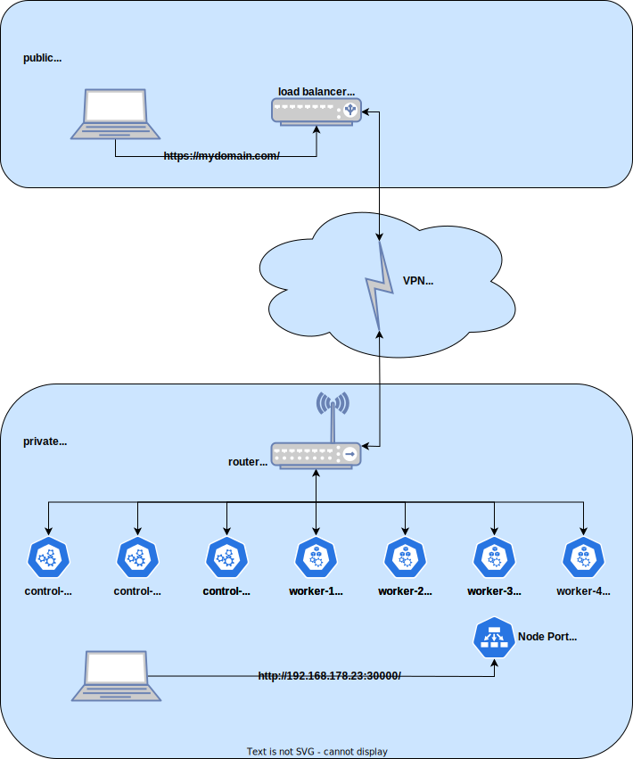

# Kuba
<ins>Kub</ins>ernetes on <ins>A</ins>lpine Linux  

If you have no idea about kubernetes, then you should read the documentation first -> [kubernetes docs](https://kubernetes.io/docs/concepts/overview/)  
tl;dr or you can easily try kubernetes with Kuba ;-)

# Description
Kuba is a shell script that creates a self-executable package for installing kubernetes.  
It is intended for Alpine Linux and can also be used in an airgap environment.

# Build
Alpine Linux version 3.18 is required to create the kuba installation package.  
In addition, bash and git are required.  
You should run the script as root, because the packages will be downloaded and installed during the build process.

The complete build process takes about 16 minutes (depending on your internet connection).

```bash
cd ~
apk add bash git
git clone https://github.com/bihalu/kuba.git
cd kuba
git fetch
git pull
./kuba-build-1.28.0.sh
```

Finally a setup package with a size of 1.4GB is created :-)
> build kuba-setup-1.28.0.tgz.self took 15 minutes 53 seconds

# Setup
Setting up a Kubernetes cluster always starts with the initialization of the first control-plane node. You can choose between a single node cluster or a multi node cluster.  

Kuba setup parameters:  

| Parameters | Description |
| --- | --- |
| `init single` | Initialize single node kubernetes cluster |
| `init cluster` | Initialize first kubernetes control-plan |
| `join worker <ip-control-plane>` | add worker node to kubernetes cluster |
| `join controlplane <ip-control-plane>` | add control-plane node to kubernetes cluster |
| `upgrade` | not implemented yet - upgrade kubernetes version |
| `delete` | not implemented yet - delete node from kubernetes cluster |

## Init single
For test and development environments, kuba can be set up as a single node cluster. This is the easiest and fastest way to create a working kubernetes cluster.

Just [copy](a "scp kuba-setup-1.28.0.tgz.self root@192.168.178.21:~") the previously created setup package to a new Alpine Linux server and start it with the parameters "init single".

```bash
./kuba-setup-1.28.0.tgz.self init single
```

The installation takes about 6 minutes.
> setup took 5 minutes 54 seconds

## Init cluster
For a multi node kubernetes cluster you start with the first control-plane. This node has only an [overlay network](a "calico") but no storage and ingress controller. You need to add additional worker nodes.

```bash
./kuba-setup-1.28.0.tgz.self init cluster
```

## Join worker
Adding a worker node is easy. However, check if you can establish an ssh connection to the control plane without entering a password. You may have to [exchange the ssh keys](docs/exchange-ssh-keys.md) beforehand.  
When a worker node is added, an ingress controller and cert manager will be installed. 

```bash
./kuba-setup-1.28.0.tgz.self join worker <ip-control-plane>
```

## Join controlplane
In a high-availability scenario, you need multiple control planes. If one fails, the others take over. The number should always be odd so that the leader can be easily determined.

```bash
./kuba-setup-1.28.0.tgz.self join controlplane <ip-control-plane>
```

## Upgrade
Upgrade not implemented

## Delete
Delete not implemented

# Requirements
Kubernetes itself doesn't need a lot of resources. It is designed to distribute the load across many nodes. If you want to operate heavy workloads in the cluster, then the count and resources for worker nodes must be adjusted in any case.

| Node | Minimum | Recommended |
| --- | --- | --- |
| `single node cluster` | 2CPU, 4GB RAM, 20GB DISK | 4CPU, 8GB RAM, 80GB DISK |
| `control-plan node` | 2CPU, 4GB RAM, 20GB DISK | 4CPU, 8GB RAM, 80GB DISK |
| `worker node` | 2CPU, 4GB RAM, 20GB DISK | 4CPU, 8GB RAM, 80GB DISK + 200GB DISK |
| `heavy worker node` | 4CPU, 16GB RAM, 80GB DISK + additional data disks | 16CPU, 64GB RAM, 200GB DISK + additional data disks |

## Storage
Kubernetes storage is a topic of its own.  
Kuba uses OpenEBS as a storage solution. OpenEBS local PV with Hostpath is used in a single node cluster. This is the carefree package.  

In a more complex scenario with multiple worker nodes, you need a different storage solution. I would also like to examine OpenEBS with mayastor and rook ceph.

# Network
Kubernetes has no specifications regarding the network. Only the nodes need to be able to communicate with each other. In practice, of course, you have to take things like a firewall or subnets into account. You also need a load balancer if you want to access the cluster from outside.  

## Homelab network example
As an example i would like to give a typical homelab network for a kubernetes cluster. You can access the kubernetes cluster within your homelab network via node ports.  
If you have a VPS with a public ip you can create a VPN site-to-site connection and route the http(s) traffic through this VPN to your kubernetes cluster. More about this in [site-to-site vpn](docs/site-to-site-vpn.md)  



# Apps
Kubernetes applications can be deployed with kubectl or helm. However, you need some experience for this. That's why I created a so-called kuba app package with a few applications. This means that the applications can be installed just as easily as kuba itself.

## Kuba app package
The kuba app package contains these applications:

* wordpress
* minio
* minecraft 

### Build
First you build the kuba app package. It then contains all necessary artefacts for the installation of wordpress, minio and minecraft in an argap environment.

```bash
cd ~
apk add bash git
git clone https://github.com/bihalu/kuba.git
cd kuba
git fetch
git pull
./kuba-apps-2023.9.sh
```

### Install
Then [copy](a "scp kuba-apps-2023.9.tgz.self root@192.168.178.21:~") the previously created app package to your kubernetes node and install the desired application.

```bash
./kuba-apps-2023.9.tgz.self install wordpress
```

### Uninstall
Uninstall is self-explanatory

```bash
./kuba-apps-2023.9.tgz.self uninstall wordpress
```

## Access apps
The applications are deployed with fixed node ports and the credentials are stored in kubernetes secrets. Here is an overview of how to access the applications. Please replace the ip address of your kubernetes node.  

| Application | Url | User | Password retrival command |
| --- | --- | --- | --- |
| wordpress | http://192.168.178.53:30000/admin | admin | echo $(kubectl get secret --namespace wordpress wordpress -o jsonpath="{.data.wordpress-password}" \| base64 -d) |
| minio | http://192.168.178.53:30001/ | admin | echo $(kubectl get secret --namespace minio minio -o jsonpath="{.data.root-password}" \| base64 -d) |
| grafana | http://192.168.178.53:30303/ | admin | echo $(kubectl get secret --namespace kube-prometheus-stack kube-prometheus-stack-grafana -o jsonpath="{.data.admin-password}" \| base64 -d) |
| prometheus | http://192.168.178.53:30090/ | none | none |
| alertmanager | http://192.168.178.53:30903/ | none | none |
| minecraft | 192.168.178.53:30003 | none | none |
