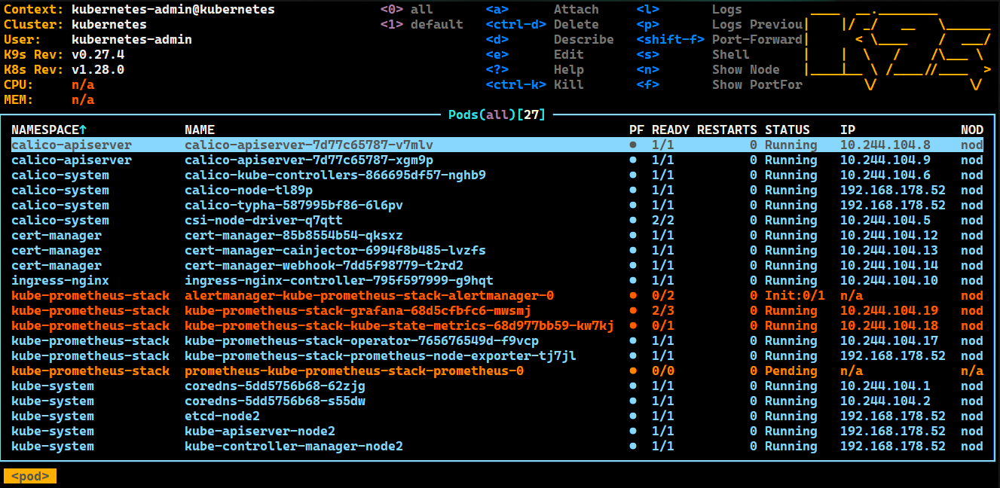

# Quickstart

You need a clean Alpine Linux version 3.18 with 4CPU, 8GB RAM and 40GB DISK.

## 1. Build KubA setup package
```bash
cd ~
apk add bash git
git clone https://github.com/bihalu/kuba.git
cd kuba
git fetch
git pull
./kuba-build-1.28.0.sh
```
Takes about 15 minutes ...  
coffe break ;-)

## 2. Build KubA app package
```bash
./kuba-apps-2023.9.sh
```
Takes about 5 minutes ...  
pee break :-o 

## 3. Setup kubernetes single node cluster 
```bash
./kuba-setup-1.28.0.tgz.self init single
```
Takes about 5 minutes ...  
almost done   

You can have a look at the cluster with k9s tool.  

```bash
k9s
```


Pods are created.  
 

## 4. Install wordpress 
```bash
./kuba-apps-2023.9.tgz.self install wordpress
```
Only 2 minutes left ...  
Follow the steps from the wordpress installation and you are done  

## Summary
You can set up a kubernetes cluster in under half an hour. If you have already built the setup and app package it is even faster. Save these packages on a usb stick and you can quickly set up a kubernetes cluster in no time.  

``/\_/\``  
``(='_')``   
``(,(")(")`` 


